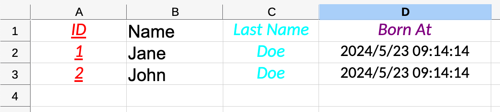

# BetterExcel

Export data to Excel quickly, simply, naturally!

- [BetterExcel](#betterexcel)
  - [使用方法 - 一个完整例子](#使用方法---一个完整例子)
  - [表头](#表头)
  - [样式](#样式)
  - [高级表格单元](#高级表格单元)
    - [图片](#图片)
    - [日期](#日期)
  - [行的渲染](#行的渲染)
- [已知局限性](#已知局限性)
- [测试](#测试)

## 使用方法 - 一个完整例子

```php
<?php

use Modules\BetterExcel\BetterExcel;
use Modules\BetterExcel\Style;
use Modules\BetterExcel\Cells\Date;
use Carbon\Carbon;

// 1. 定义表格头
$columns = [
    'id' => [
        'label' => 'ID',
        // 以 Fluent Style API设置表头样式。
        'style' =>  (new Style())->bold()->underline()->font('red', 12)->align('center'),
    ],
    'first_name' => [
        'label' => 'Name',
        //  也可以，用数组的形式设置表头样式。
        'style' => [
            'font' => [
                'styles' => ['italic', 'bold'],
                'size' => 12,
            ],
            'underline' => 'single',
            'alignment' => [
                'horizontal' => 'center',
                'vertical' => 'center',
            ],
        ]
    ],
    'last_name' => [
        'label' => 'Last Name',
        'style' =>  (new Style())->italic()->underline()->font('cyan', 12)->align('center'),
    ],
    'born_at' => [
        'label' => 'Born At',
        'style' =>  (new Style())->italic()
            ->font('purple', 12)->align('center', 'center')
            ->width(20),
    ],
];

# 2. 假设，用 Generator加载大量数据
$list = function() {
    // The born_at column shows you how to export datetime.
    yield [ 'id' => 1, 'first_name' => 'Jane', 'last_name' => 'Doe', 'born_at' => Date::fromTimeStamp(time())];
    yield [ 'id' => 2, 'first_name' => 'John', 'last_name' => 'Doe', 'born_at' => Date::fromCarbon(Carbon::now())];
};

$betterExcel = new BetterExcel($list(), [
    'path' => __DIR__
]);
$betterExcel->setHeader($columns);

# 3. 导出为 excel
echo $betterExcel->export('test.xls');
```

It outputs something like below



## 表头

结构如下:

```php
$columns = [
    'id' => [
        'label' => 'ID', # excel 的表头显示名。

        // 以 Fluent Style API设置表头样式。
        'style' =>  (new Style())->bold()->underline()->font('red', 12)->align('center'),
    ],
    'name' => [
        'label' => 'Name',
        //  以数组的形式设置表头样式。
        'style' => [
            'font' => [
                'styles' => ['italic', 'bold'],
                'size' => 12,
            ],
            'underline' => 'single',
            'alignment' => [
                'horizontal' => 'center',
                'vertical' => 'center',
            ],
        ]
    ],
    'born_at' => [
        'label' => 'Born At',
        'style' =>  (new Style())->italic()
            ->font('purple', 12)->align('center', 'center')
            ->width(20),
    ],
];
```

上述表头的列`id`, 表示获取某行数据，键为`id` 的值, 如。
```
[ 'id' => 1, 'name' => 'Jane', 'born_at' => Date::fromTimeStamp(time())]
```
如果列与数据的键不一致，也可以在表头定义中，设置`path`字段， `path`的格式与 Laravel `data_get`格式一致， 可以用于获取嵌套的数据。如
```php
$columns = [
    'id' => [
        'label' => 'ID',
        'path' => 'user.id',
    ],
]
```

在通过 path 获取到对应的值时候，可以通过`resolver`进行初步的处理，如：
```php
$columns = [
    'id' => [
        'label' => 'ID',
        'path' => 'user。id',
        'resolver' => function($value, $row) {
            return sprintf('Superman %s', $value);
        },
    ],
]
```

## 样式

* 简单数组

```
Style::fromArray(
    [
        'font' => [
            'styles' => ['italic', 'bold'],
            'size' => 12,
        ],
        'underline' => 'single',
        'alignment' => [
            'horizontal' => 'center',
            'vertical' => 'center',
        ],
    ]
);
```

* Fluent Style API
  
```
(new Style())->bold()->underline()->font('red', 12)->align('center'),
```

所有的可用方法，请参考`Modules\BetterExcel\Style`, 这个类只是[PHP-Xlswriter
样式列表](https://xlswriter-docs.viest.me/zh-cn/yang-shi-lie-biao)的简单封装。

另外，关于`颜色`，`下划线`、`对齐`，你可以在`Modules/BetterExcel/XlsWriterFormatConstantsTrait.php`快速找到所有预定义的选项。

## 高级表格单元

通过前面的`path`, `resolver`字段返回的值， 可以是一个带`render`方法对象, 这个方法会在写入 excel 时候调用。这种用法，意味着，你将自己负责渲染这个cell， closure的参数已经告诉你单元格具体的`行`，`列号`，以及分配的`列字母`($column->getLetter()), 你完全可以自己渲染。

这里的高级单元格，都是通过这中方法实现的。

### 图片

在数据中，返回`Modules\BetterExcel\Cells\EmbedImage` 对象即可。

```php

[ 'id' => 1, 'name' => 'Jane', 'avatar' => EmbedImage::fromUrl('https://gravatar.com/avatar/fc8c88023f9efa517dbd7cece0c54167?s=400&d=robohash&r=x')];

```

### 日期

在数据中，返回`Modules\BetterExcel\Cells\Date` 对象即可。

```php
[ 'id' => 1, 'name' => 'Jane', 'born_at' => Date::fromTimeStamp(time())];
[ 'id' => 2, 'name' => 'John', 'born_at' => Date::fromCarbon(Carbon::now())];
```

## 行的渲染

有的时候，你可能要根据行的数据，对表格进行特殊处理。

你可以让一行数据，返回一个带 `render` 方法的包装对象, 看起来这样，注意`render`必须，返回原数据，这是为了避免，代理其他方法到你的底层数据, 因为底层数据不一定是简单的数组。

```
class SpecialRow 
{
    private $data;
    public function __construct($data) 
    {
        $this->data = $data;
    }

    public function render(XlsWriter $writer, $rowIndex, array $columns)
    {
        //TODO: 根据行索引($rowIndex)， 表头全部列($columns), 使用$writer处理表格。

        return $this->data;
    }
}

```

使用方法
```
[
new SpecialRow([ 'id' => 1, 'name' => 'Jane', 'born_at' => Date::fromTimeStamp(time())]),
[ 'id' => 2, 'name' => 'John', 'born_at' => Date::fromCarbon(Carbon::now())];
]
```
# 已知局限性

-   未支持多个 sheet。

# 测试

```
vendor/bin/phpspec run Modules/Export/spec/BetterExcelSpec.php
```
